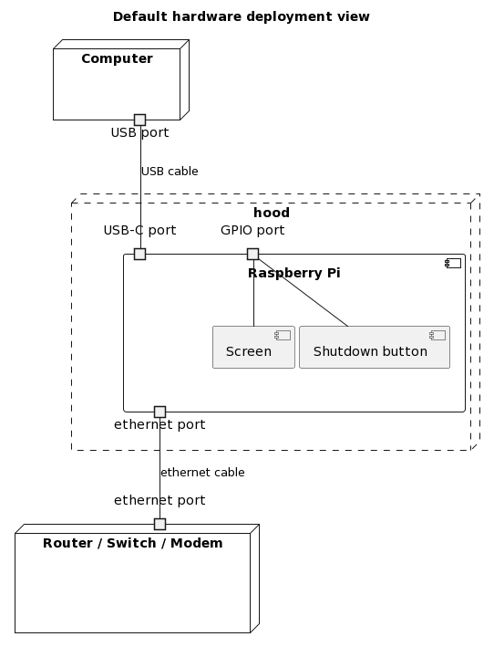

# hood
Things of my MSc thesis about a firewall system for working in unsafe environments.

It's not hard to point out someone is wearing a hood, but the hood makes it harder to say who is wearing it.
## Table of Contents
1. [Status](#status)
2. [Graphics to show the concept](#graphics-to-show-the-concept)
2. [Recommended hardware](#recommended-hardware)
3. [Install to Raspberry Pi](#install-to-raspberry-pi)
4. [Install to Debian](#install-to-debian)
5. [License](#license)

## Status

### Firewall hardware
 - [x] Raspberry Pi 4B
 - [x] Regular computer
 - [ ] Others not tested

### Operating systems to use the firewall
 - [x] Windows 10
 - [x] Linux ([Raspberry Pi OS](https://www.raspberrypi.com/software/operating-systems/) / [Debian live](https://www.debian.org/CD/live/) / [Parrot OS](https://www.parrotsec.org/))
 - [x] Mac OS

### Todo
 1. Show realtime network activities on a screen
 2. Support HTTP3 QUIC 
 3. Apply virtualization https://maimai.cn/web/feed_detail?fid=1733012779&efid=ntnLQCMgu6NRj1NgHnQ5gA

## Graphics to show the concept





## Recommended hardware
 - SBC: Raspberry Pi 4B
 - Screen: Waveshare 35a / Joy-IT RB-TFT3.5 

## Install to Raspberry Pi

If you already know how to write raspberrypi os image to a SD card, goto step 3

### Step 1. Download the latest raspberrypi OS lite image (64bit)
```shell
curl -L -O -C - https://downloads.raspberrypi.com/raspios_lite_arm64/images/raspios_lite_arm64-2023-12-11/2023-12-11-raspios-bookworm-arm64-lite.img.xz
```
### Step 2. Write the image to a SD card

```shell
xz -c -d 2023-12-11-raspios-bookworm-arm64-lite.img.xz | sudo dd of=/dev/sdX bs=4M status=progress
```
You may need `lsblk` command to locate the device name of your SD card.

### Step 3. Get Hood
You can get it as a zip file from the `Download ZIP` button of the dropdown menu triggered by the `Code ` button on the top.

Or you can use following command

```shell
git clone --depth=1 https://github.com/YongBinnnnnnnnnnnnnnnnnnnnnnnnnnnnnnnnn/hood.git
```

### Step 4. Install hood

Firstly, use `lsblk` command to check the device name of you SD card, 

Then, use following command to ensure the partitions are not mounted (replace sdX with SD card device name)

```shell
sudo umount /dev/sdX*
```

Then, use following command to ensure the partitions are not mounted. Correct output is nothing (replace sdX with SD card device name)

```shell
mount|grep sdX
```

Then, start to install (replace sdX with SD card device name)

```shell
cd hood/scripts
./install.sh target=sdX
```

Commandline options available to the install script:

|Name                  |Default Value      |Description                                                                                                         |
|----------------------|-------------------|--------------------------------------------------------------------------------------------------------------------|
|usb_tether=           |1                  |Share network to computer via USB cable                                                                             |
|harden_only=          |0                  |Only apply hardening parts. Let the target SBC can still be used as a computer.                                     |
|disable_wireless=     |1                  |Disable WiFi and Bluetooth.                                                                                         |
|disable_gpu=          |1                  |Disable GPU.                                                                                                        |
|debian_live           |N/A                |Install to live debian environment.                                                                                 |
|gpio_shutdown_pin=    |21                 |The GPIO pin used for shutdown the computer                                                                         |
|screen_dtbo=          |OMITTED            |The path of the dtbo file for the screen used for the computer                                                      |
|target=               |/                  |The target root/device to install firewall.                                                                         |
|wan_port_device_path= |auto-built-in-eth  |The path of the device to be used as WAN port. `auto-built-in-eth` means find built-in Ethernet port automatically. |

## Install to Debian

Hood firewall now is possible to be installed to debian-based Linux systems. This feature has been tested in the live environment of Parrot OS 6.0.

### Step 1. Get Hood

```shell
git clone --depth=1 https://github.com/YongBinnnnnnnnnnnnnnnnnnnnnnnnnnnnnnnnn/hood.git
```
### Step 2. Install hood

```shell
cd hood/scripts
./install.sh debian_live
```

### Step 3. Reboot
If your are using a live environment created by an ISO image, you may want soft-reboot

```shell
sudo systemctl soft-reboot
```
In other situations, a regular reboot would be a better choice.

## License

hood by Bin Yong is licensed under [CC BY-NC-ND 4.0](https://creativecommons.org/licenses/by-nc-nd/4.0/)
